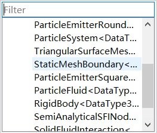

## Structure of a node
The follow code demonstrates a typical implementation of a node that handles the one-way coupling between particles and static trianglar boundaries.

```go
template<typename TDataType>
class StaticMeshBoundary : public Node
{
  DECLARE_CLASS_1(StaticMeshBoundary, TDataType)
public:
  typedef typename TDataType::Real Real;
  typedef typename TDataType::Coord Coord;
  typedef typename TopologyModule::Triangle Triangle;

  StaticMeshBoundary();
  ~StaticMeshBoundary() override;

  void advance(Real dt) override;
public:
  /**
    * @brief Input rigid bodies
    */
  DEF_NODE_PORTS(RigidBody, RigidBody<TDataType>, "A rigid body");

  /**
    * @brief Input particle systems
    */
  DEF_NODE_PORTS(ParticleSystem, ParticleSystem<TDataType>, "Particle Systems");


public:
  /**
    * @brief Particle position
    */
  DEF_EMPTY_CURRENT_ARRAY(ParticlePosition, Coord, DeviceType::GPU, "Particle position");


  /**
    * @brief Particle velocity
    */
  DEF_EMPTY_CURRENT_ARRAY(ParticleVelocity, Coord, DeviceType::GPU, "Particle velocity");

  /**
    * @brief Triangle vertex
    */
  DEF_EMPTY_CURRENT_ARRAY(TriangleVertex, Coord, DeviceType::GPU, "Particle position");

  /**
    * @brief Particle velocity
    */
  DEF_EMPTY_CURRENT_ARRAY(TriangleIndex, Triangle, DeviceType::GPU, "Particle velocity");

private:
  /**
    * @brief Define other private members below
    */
};
```
To be recognized by the reflecting system in PhysIKA, each class should be started with the following macro definition
```go
  DECLARE_CLASS(ClassName)
```
or
```go
  DECLARE_CLASS_1(ClassName, TemplateName)
```
for templated class.

The above declaration should be concluded with the following macro definition 
```go
  IMPLEMENT_CLASS(ClassName)
```
or
```go
  IMPLEMENT_CLASS_1(ClassName, TemplateName)
```
for templated class.

Then, an instance of StaticMeshBoundary can correctly created by passing the class name to the static function in the Object class.
```go
  static Object* createObject(std::string name);
```

In addition, an instance of the reflected class can also be create from the PhysIKA Studio.


### Node Ports

### Mechanical Status

### Topology

