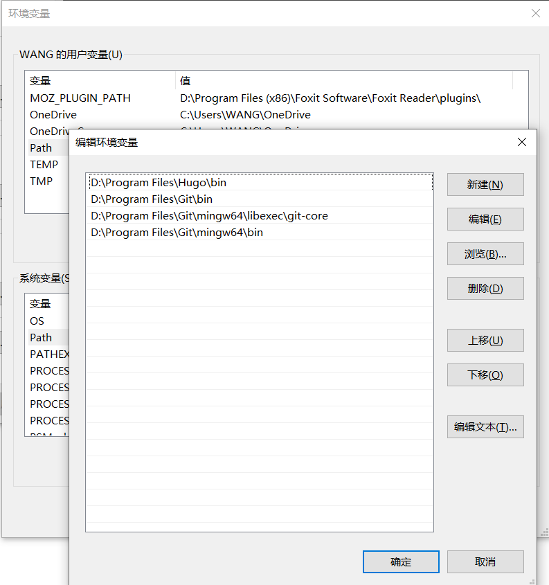
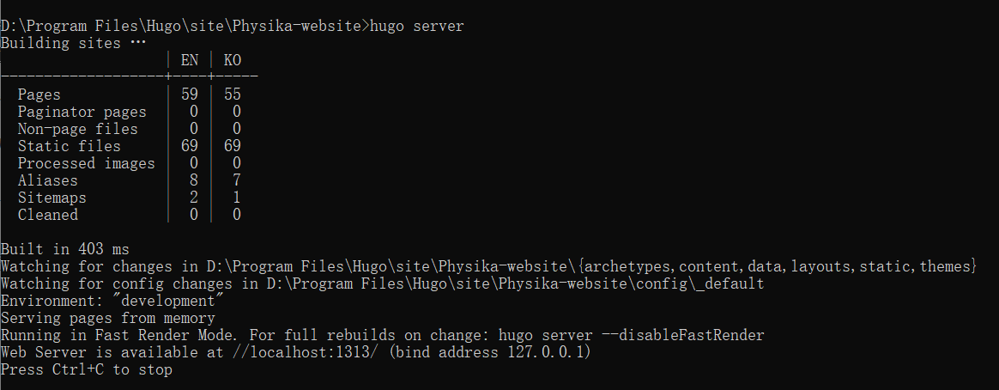

For a simple modification, you can just click `Edit this page` on the right side of the window.
If you want to modify the documentation or website structure, you can follow the tutorial below.


Install Hugo
--------

Click [Here](https://github.com/gohugoio/hugo/releases) to download hugo executable file, you must download an extended version.

For example, the 64-bit Windows operating system should download `hugo_extended_0.75.1_Windows-64bit.zip`.

Environment variables configuration
--------

Config the path where .exe file exist to environment variables. 

For example, the path is`D:\Program Files\Hugo\bin`


Add/Modify markdown files
-------------
Clone our code `git clone https://github.com/PhysikaTeam/PhysIKA-website.git`
and add/modify new markdown file to add/modify new pages in the website. 
if you want to add a new combobox, just add a new forder in the content directory. Every forder needs an `_index.md` file. 
The file format looks like this.
```
---
title: "Documentation"
linkTitle: "Documentation"
weight: 20
menu:
  main:
    weight: 20
---
```


Start and run
---------

In the cmd window, you should enter into current folder and input `hugo server` to launch the local server. 
You will see the following window

And then, you can just copy this URL `http://localhost:1313/` to your browser for access.


Pull requests
---------
Finally, you should make a "Pull requests" at our github repository. Thanks for your contribution to PhysIKA 
OpenSource project!