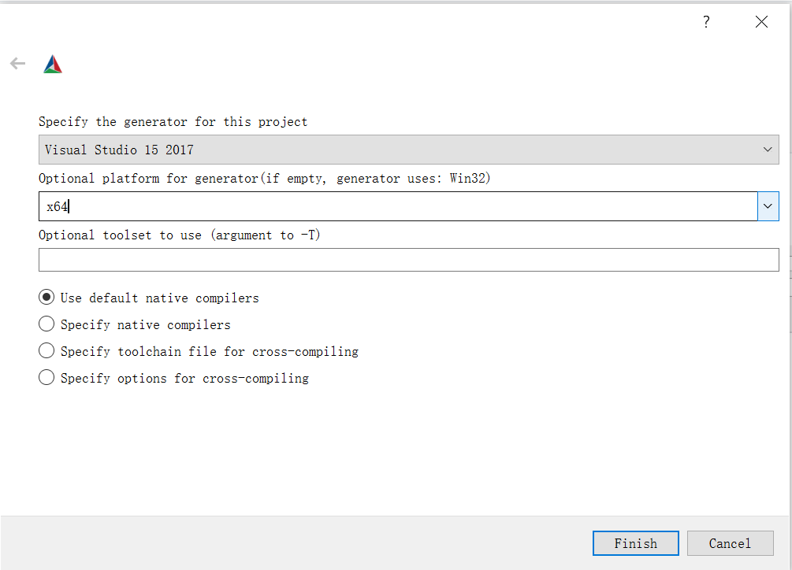

# How to build physika  in windows environment

This page tells you how to build physika, including installation and basic configuration.

### Install Cmake

1. Download the latest version of cmake executable file(Click [Here](https://cmake.org/download/) to download cmake executable file).
2. Double click to install directly.

### Install Cuda 11.0

1. Download cuda11.0(Click [Here](https://developer.nvidia.com/cuda-downloads?target_os=Windows&target_arch=x86_64&target_version=10&target_type=exelocal) to download cuda11.0 executable file)

2. Double click to install directly.

3. Open the command line and enter the nvcc -V command. The following message appears, indicating that the installation is successful.

   

### Install **Visual Studio 2017**

1. Download Visual Studio 2017(Click [Here](https://visualstudio.microsoft.com/zh-hans/vs/older-downloads/) to download visual studio 2017 executable file)

2. The community version of visual studio is free. It is recommended to install the community edition.

3. Choose what you need to install.

   

### Install PhysiKA

1. pull the latest version of the Physika project by directly using `git clone`.

   ```
   git clone https://github.com/PhysikaTeam/PhysIKA.git
   cd PhysIKA
   git submodule update --init --recursive`
   git checkout -b dev
   git pull origin dev
   ```

2. Use cmake to compile and generate the corresponding project.

   

3. Configure to set up Visual Studio 2017 and 64-bit. Before that, make sure you install python3.7、cuda11.0 and Visual Studio 2017.

   

4. After generation, such a folder will be generated. Open with visual studio 2017 sln file.

   

5. Run the project under the example folder. You will see the following results.

   


