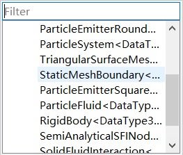

## 节点的结构
以下代码演示了使用节点对粒子与静态三角形边界之间的单向耦合处理的典型实现。
```go
template<typename TDataType>
class StaticMeshBoundary : public Node
{
  DECLARE_CLASS_1(StaticMeshBoundary, TDataType)
public:
  typedef typename TDataType::Real Real;
  typedef typename TDataType::Coord Coord;
  typedef typename TopologyModule::Triangle Triangle;

  StaticMeshBoundary();
  ~StaticMeshBoundary() override;

  void advance(Real dt) override;
public:
  /**
    * @brief Input rigid bodies
    */
  DEF_NODE_PORTS(RigidBody, RigidBody<TDataType>, "A rigid body");

  /**
    * @brief Input particle systems
    */
  DEF_NODE_PORTS(ParticleSystem, ParticleSystem<TDataType>, "Particle Systems");


public:
  /**
    * @brief Particle position
    */
  DEF_EMPTY_CURRENT_ARRAY(ParticlePosition, Coord, DeviceType::GPU, "Particle position");


  /**
    * @brief Particle velocity
    */
  DEF_EMPTY_CURRENT_ARRAY(ParticleVelocity, Coord, DeviceType::GPU, "Particle velocity");

  /**
    * @brief Triangle vertex
    */
  DEF_EMPTY_CURRENT_ARRAY(TriangleVertex, Coord, DeviceType::GPU, "Particle position");

  /**
    * @brief Particle velocity
    */
  DEF_EMPTY_CURRENT_ARRAY(TriangleIndex, Triangle, DeviceType::GPU, "Particle velocity");

private:
  /**
    * @brief Define other private members below
    */
};
```
为了被PhysIKA中的反射系统识别，每个类都应该从以下宏定义开始：
```go
  DECLARE_CLASS(ClassName)
```
或者
```go
  DECLARE_CLASS_1(ClassName, TemplateName)
```
作为模板类。

以上声明应以以下宏定义作为实现。
```go
  IMPLEMENT_CLASS(ClassName)
```
or
```go
  IMPLEMENT_CLASS_1(ClassName, TemplateName)
```
作为模板类。


然后，可以通过将类名称传递给Object类中的静态函数来创建StaticMeshBoundary实例。
```go
  static Object* createObject(std::string name);
```

此外，还可以从PhysIKA Studio创建反射类的实例。


### 节点端口

### 节点状态

### 拓扑结构

待完善